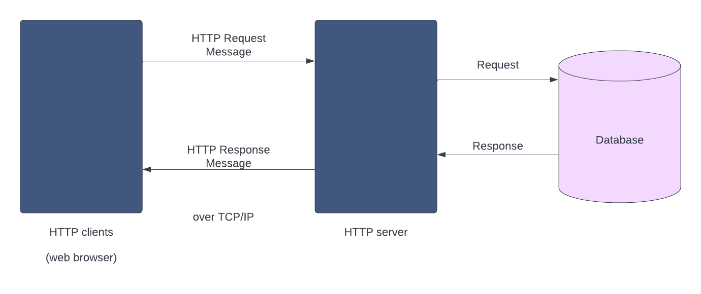

# Movies-Library

# Project Name - Project Version

**Author Name**: Raghd Mohamad Amin AL-Smadi

## WRRC

## Overview

## Getting Started
# Task 11
1-npm init -y
2-Create server.js
3-Install express package to use it npm install express
4-Adding the server code inside server.js
5-Running the server using node server.js

## Project Features
Some data about the spider man movie that showed at home page.
Welcoming message for favorite page.
Handling some common errors (status: 404, 500).

## WWRC TASK 13
